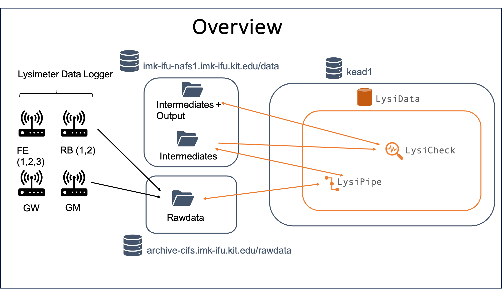
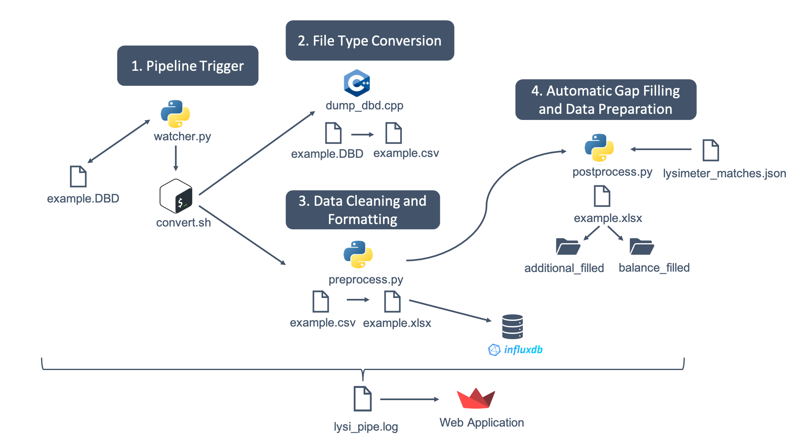
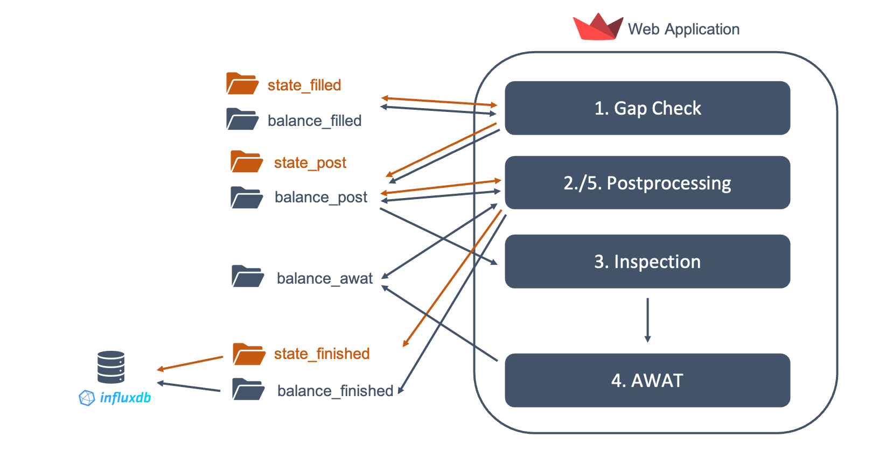

# Lysimeter Pipeline Master Thesis

This is the repository for the lysimeter data processing pipeline from the master thesis <i>Automated Processing and Quantification of Water Balance Components of Lysimeter Grassland Systems Under Varying Climate Conditions</i>. Even though in this thesis the pipeline is only applied to the sites in **Fendt** and **Graswang**, the pipeline and its application to the additional sites **Garmisch** and **Rottenbuch** is explained here. It is explained from data being pushed from the logger at these sites on the rawdata IFU server up to the final cleaned, gap filled and post-processed lysimeter data.

## Directory Overview

Before the Pipeline is described, here is an overview of the repo in order to find the code for the different module and components of the pipeline.

- `awat` folder contains all code for applying and deploying the AWAT filter
- `images` folder contains all images for the `README.md` file
- `lysi_check` folder contains all code for applying and deploying the _LysiCheck_ module
- `lysi_pipe` folder contains all code for applying and deploying the _LysiPipe_ module
- `convert.sh` file for reacting to newly uploaded data from the loggers
- `dashboard_clean.json` and `dashboard_raw.json` are the config files for the _Grafana_ dashboards for the clean and raw data
- `docker-compose.yaml` and `Dockerfile` are the files for deployment of the whole pipeline and the watchdog, respectively
- `resolve_date_errors.py`, `resolve_pipe_errors.py`, `resolve_pipe_errors.sh` and `resolve_post_errors.py` are files to run when the pipeline is deployed and different errors occur. _Date errors_ occurr when due to malfunction of the logger multiple dates are sent at one day. In order to also apply the other additional dates this error-handling script can be applied. _Pipe errors_ are errors when during the _LysiPipe_ module some errors occur and the whole pipeline needs to be rerun for a specific date/file. Similarly, _Post errors_ are only errors in the _postprocessing.py_ appear and a specific date/file needs to be rerun
- `watcher.py` file for applying the watchdog

All these different files etc. of the pipeline and its general structure will be explained in the following. Details that cannot be found here, can be found in the master thesis.

## Pipeline

The overview of the lysimeter pipeline with its components can be seen in the following:

 

 

As it can be seen there are two big components included in the pipeline: **LysiPipe** and **LysiCheck** that can be summarized as **LysiData**. Both components will be explained in greater detail in the following.

### LysiPipe

This part of the pipeline is responsible for reacting when new files are pushed to the rawdata directory on the _archive-cifs.imk-ifu.kit.edu/rawdata_ server from the logger of the different lysimeters. It is responsible for alle data preparation techniques that can be applied _completely automated_.

In the following the detailed overview what happens in this component can be seen:

 

 

#### 1. Pipeline Trigger

When a new file is pushed to the rawdata directory, the _watcher.py_ file is activitated which results in that the newly added file is copied into a new directory and the bash script _convert.sh_ is applied.

#### 2. File Type Conversion

This script applies the C++ script _dumpdbd.cpp_ script that is able to convert over multiple other steps the .DBD file to a .csv file.

#### 3. Data Cleaning and Formatting

This file is read by the python file _preprocess.py_ which is also applied by the _convert.sh_ script. This python script does the following:

- Restructure data from DBD format into clean format
- Rounds timesteps to minutes e.g., 2023-05-10 10:01:12233123123.4232 to 2023-05-10 10:01:00
- Replace error codes (990.0,999.8,-999.8,999.0,-99.8,Overrange, Underrange) with NAs and flag them

This raw output is written to an _InfluxDB_ where the data is visualized in a _Grafana_ dashboard for the raw data and as .xlsx file on the _imk-ifu-nafs1.imk-ifu.kit.edu/data_ server.

#### 4. Automatic Gap Filling and Data Preparation

In the next step, this rawdata is used by the python script _postprocess.py_. This script does the following:

- Fill multi gaps with regression values from partner lysimeter (specified in lysimeter_matches.json)
- Fill left over single gaps with linear interpolation
- Flag filled gaps or gaps that could not be filled
- Apply correction of lysimeter weight due to chamber measurements with previous date for edge cases
- In case this is the first data sheet, extra detection is applied

This output is written to some intermediate folders on the _imk-ifu-nafs1.imk-ifu.kit.edu/data_ server for balance components which summarizes the data from schedule I that includes the weight data for the water tank and the lysimeters and the additional components which summarizes the extra data e.g., soil moisture from the schedule H.

All that is realized in a Docker container and the data in the folders that can be seen in the folders are just temporary except the data that exist outside the orange box which is also marked in the previous text.

Everything is logged to a log file so that it can be comprehended afterwards when something went wrong. This can be visually explored in an GUI created with _Streamlit_ and is realized in another Docker container.

### LysiCheck

This part of the pipeline is responsible for all the manual part of the pipeline where the user has to all the cleaning and post-processing as well as the checking of the gaps that have been filled in the previous step.

The water balance data is treated differently than the data for the additional variables, also referred to as _state variables_. The details of the two big steps from **LysiCheck** for water balance componrnts and state variables can be seen in the following image:

 

 

#### 1. Gap Check

The gaps that were filled during _LysiCheck_ are visually displayed here and they can be either accepted and the filled gap is introduced in the data or it can be rejected and the original is reintroduced in the data.

#### 2. Postprocessing

The data can be cleaned, post-processed and displayed by user evaluation using several different filtering and filling methods offered by the web application. Detailed description of the different processing methods is given in the master thesis. After this step, the state variables are finished and written to the _InfluxDB_ and is subsequently visualized in a _Grafana_ dashboard for the cleaned data. However, the water balance data consists so far only of weight changes that must be first transformed into the water balance components _precipitation_ (P), _seepage water_ (Q) and _actual evapotranspiration_ ($ET_a$) as explained in the master thesis.

#### 3. Inspection

In this step, the data is brought into the shape for the AWAT-Filter. Hence, the seepage water tank weight data which has a specific shape due to the water release events is brought into a cumulative time-series withouth these events. In order to get rid of the water release events they are detected and removed and a zero changing rate is assumed during this period. This seepage water tank weight data and lysimeter weight data is compared visually between the different lysimeters to detect some still-existing errors in the data or missed water release events.

#### 4. AWAT

The prepared weight data is put into the AWAT filter to reduce the noise that still exists in the data. Finally, after the AWAT filter has been applied, the calculated water balance components are aggregated to daily values.

#### 5. Postprocessing

The daily values of the water balance components can now be finally post-processed again and the same functionalities as in 2. step are available. Finally, the data is also written to the _InfluxDB_ and shown in the _Grafana_ dashboard for cleaned data.

**LysiCheck** is realized as an GUI created with _Streamlit_ and as a Docker container. The _AWAT_ step is also realized as Docker container.

In general, the _InfluxDB_ and _Grafana_ for _LysiCheck_ and _LysiPipe_ are also realized as Docker container.
