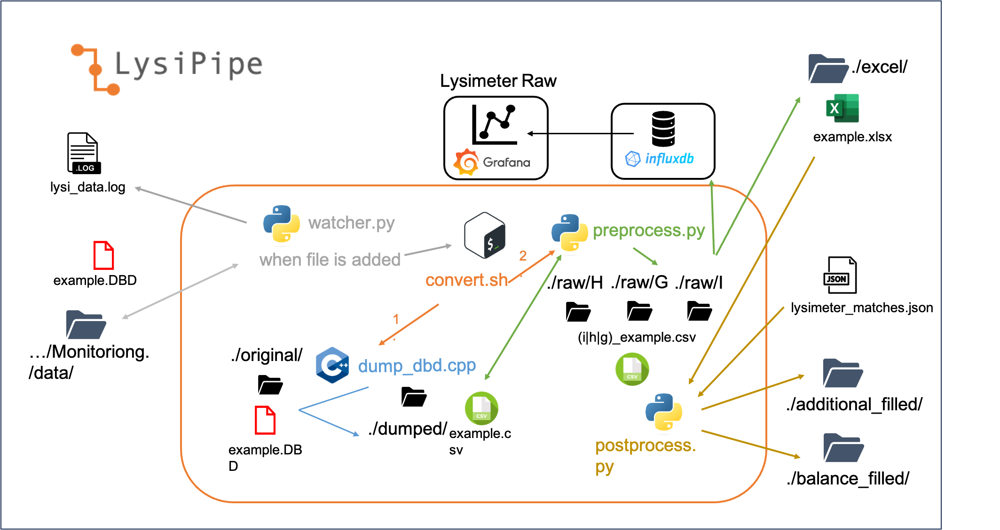
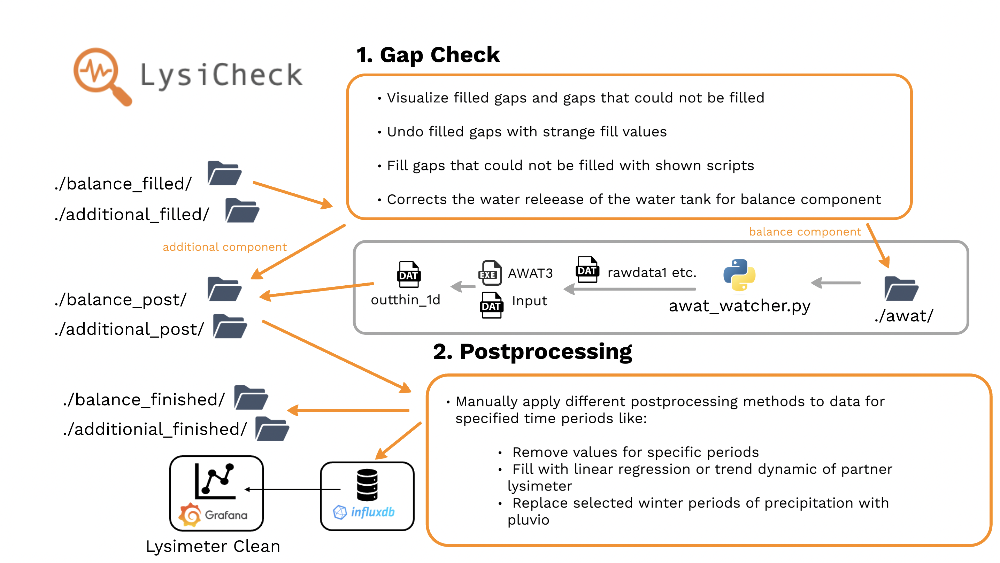

# Lysimeter Pipeline

This is the repository for the current state of the lysimeter data pipeline from the data that is pushed from the locations **Fendt, Graswang, Garmisch and Rottenbuch** on the rawdata IFU server up to the final cleaned, gap-filled and postprocessed lysimeter data.

The overview of the lysimeter pipeline with its components can be seen in the following:

 

 

As it can be seen there are two big components included in the pipeline: **LysiPipe** and **LysiCheck** that can be summarized as **LysiData**. Both components will be explained in greater detail in the following.

## LysiPipe

This part of the pipeline is responsible for reacting when new files are pushed to the rawdata directory on the _archive-cifs.imk-ifu.kit.edu/rawdata_ server from the logger of the different lysimeters. It is responsible for alle data preparation techniques that can be applied _completely automated_.

In the following the detailed overview what happens in this component can be seen:

 

 

When a new file is pushed to the rawdata directory, the _watcher.py_ file is activitated which results in that the new file is copied into the _./original/_ folder and the bash script _convert.sh_ is applied. This script applies the C++ script _dumpdbd.cpp_ script that is able to convert over multiple other steps the .DBD file to a .csv file.

This file is read by the python file _preprocess.py_ which is also applied by the _convert.sh_ script. This python script does the following:

- Restructure data from DBD format into clean format
- Rounds timesteps to minutes e.g., 2023-05-10 10:01:12233123123.4232 to 2023-05-10 10:01:00
- Replace error codes (990.0,999.8,-999.8,999.0,-99.8,Overrange, Underrange) with NAs and flag them

This raw output is written to an influxdb where the data is visualized in a _grafana_ dashboard and as .xlsx file on the _imk-ifu-nafs1.imk-ifu.kit.edu/data_ server. Additionally, this rawdata is used by the python script _postprocess.py_. This script does the following:

- Fill multi gaps with regression values from partner lysimeter (specified in lysimeter_matches.json)
- Fill left over single gaps with linear interpolation
- Flag filled gaps or gaps that could not be filled
- Apply correction of lysimeter weight due to chamber measurements with previous date for edge cases
- In case this is the first data sheet, extra detection is applied

This output is written to some intermediate folders on the _imk-ifu-nafs1.imk-ifu.kit.edu/data_ server for balance components which summarizes the data from schedule I that includes the weight data for the water tank and the lysimeters and the additional components which summarizes the extra data e.g., soil moisture from the schedule H.

All that is realized in a docker container and the data in the folders that can be seen in the folders are just temporary except the data that exist outside the orange box which is also marked in the previous text.

Everything is logged to a log file so that it can be comprehended afterwards when something went wrong. This can be visually explored in an GUI created with _streamlit_ and is realized in another docker container.

## LysiCheck

This part of the pipeline is responsible for all the manual part of the pipeline where the user has to all the cleaning and postprocessing as well as the checking of the gaps that have been filled in the previous step.

The details of the two big steps from **LysiCheck** can be seen in the following image:

 

 

As the _Gap Check_ and _Postprocessing_ steps are explained in the image in detail only the rest will be explained here.

The data written out from the _Gap Check_ step is either written to the next folders for the balance component or need to go first through the AWAT filter for the additional component. Here the weight of the lysimeter is smoothed and the different balance components are calculated from the lysimeter weight and water tank weight. When this data for both components is written out from the _Postprocessing_ step after finishing this step is written to the influxdb and visualized in a _grafana_ dashboard.

**LysiCheck** is realized as an GUI created with _streamlit_ and as a docker container. The _awat_watcher.py_ watchdog is also realized as docker container.
